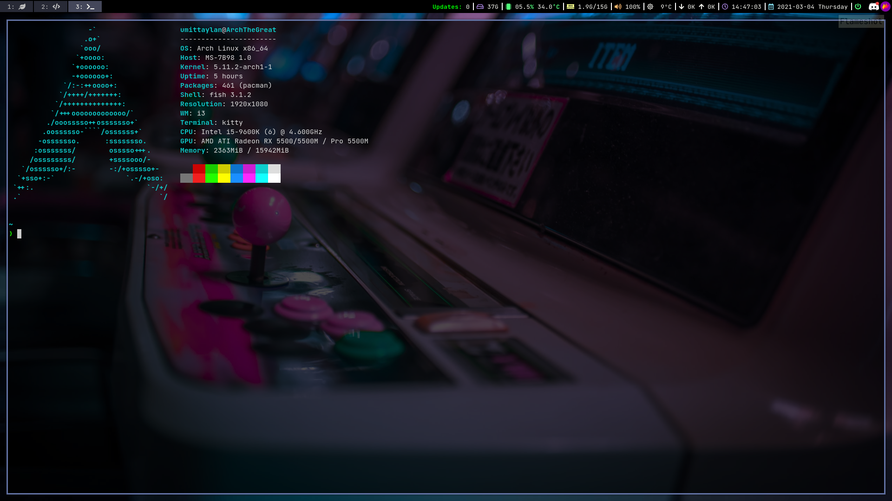
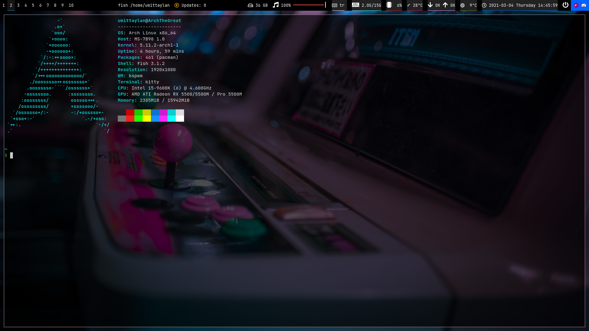

# Arch Linux [i3-gaps + i3blocks + Fish + Starfish]

**For Shell:**
| Package                                                  | Description                                                      |
|----------------------------------------------------------|------------------------------------------------------------------|
| [Arch Linux](https://www.archlinux.org/)                 | The best distro ever!                                            |
| [Fish](https://github.com/fish-shell/fish-shell)                  | The most powerful shell out there!                               |
| [Starship](https://starship.rs/) | Beautiful and detailed shell prompt for any shell!                 |
| [Neofetch](https://github.com/dylanaraps/neofetch)       | The Most detailed system info script                   |
| [Font Awesome](https://fontawesome.com/)    | Fonts with lots of amazing icons |

**For The i3 Window Manager:**
| Package                                                                   | Description                                                                       |
|---------------------------------------------------------------------------|-----------------------------------------------------------------------------------|
| [i3-gaps](https://github.com/Airblader/i3)                                | i3wm with more features                                                           |
| [i3blocks](https://github.com/vivien/i3blocks)                            | A replacement for the default i3status with more features                         |
| [Font Awesome](https://fontawesome.com)                     | Fonts with lots of amazing icons                   |
| [Rofi](https://github.com/DaveDavenport/rofi)                             | A window switcher, application launcher and dmenu replacement                     |
| [Picom](https://github.com/yshui/picom)                                | A compositor for X, to get window transparency and avoid tearing and vsync issues |
| [Playerctl](https://github.com/acrisci/playerctl)                         | To display current song on i3blocks                                               |
| Nitrogen                                        | Image viewer, useful to set a wallpaper                                           |
| xfce4-power-manager                                                       | Simple way to monitor battery status                                              |
| xfce4-notifyd                                                             | Helpful to get GTK notifications like current song or battery status              |
| [pacman-contrib](https://www.archlinux.org/packages/?name=pacman-contrib) | Contributed scripts and tools for pacman systems                                  |
---
# Arch Linux [bspwm + polybar + Fish + Starfish]

**For The BSPWM:**
| Package | Description |
|----|----|
| [bspwm](https://github.com/baskerville/bspwm) | A Simple window manager with simple configuration |
| [sxhkd](https://github.com/baskerville/sxhkd) | A Simple X Hotkey Deamon |
| [polybar](https://github.com/polybar/polybar) | An awesome status bar |
| [Font Awesome](https://fontawesome.com) | Fonts with lots of amazing icon |
| [Picom](https://github.com/yshui/picom) | A compositor for X, to get window transparency and avoid tearing and vsync issues |
| [Rofi](https://github.com/DaveDavenport/rofi) | A window switcher, application launcher and dmenu replacement |
| Nitrogen | Image viewer, useful to set a wallpaper |
| [pacman-contrib](https://www.archlinux.org/packages/?name=pacman-contrib) | Contributed scripts and tools for pacman systems |